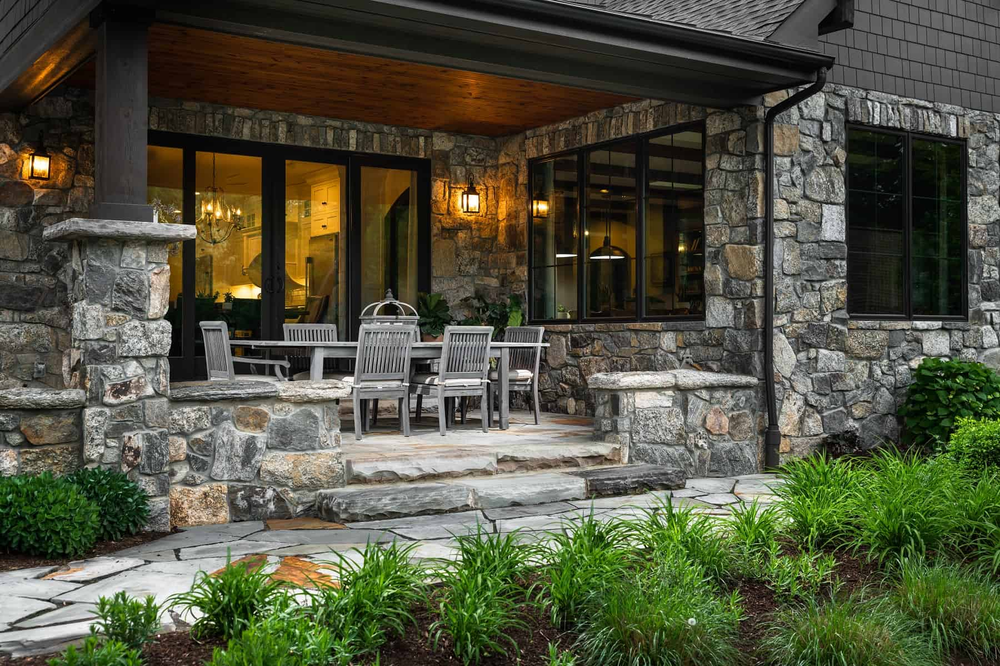
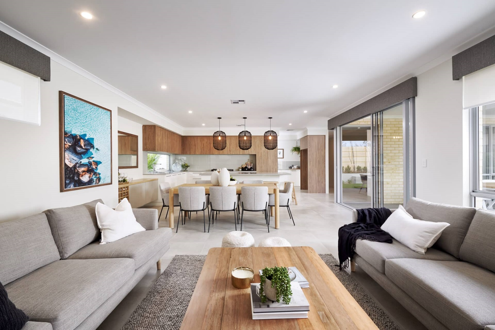
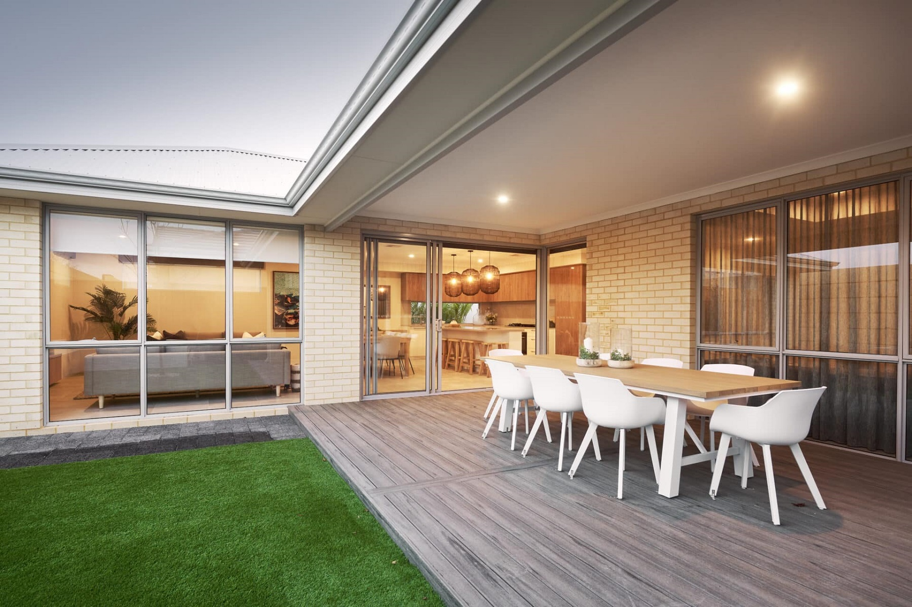

# 🏠 Homyz — Premium Real Estate Website


> A modern, fully responsive real estate website built for the Delhi NCR region.

🌐 **Live Demo:** [👉 Click Here to Visit](https://shudanshubora1410.github.io/Homyz)

---

## 👨‍💻 Developer

| Detail | Info |
|--------|------|
| 👤 **Name** | Shudanshu Sanjay Bora |
| 🎓 **Degree** | B.Tech — Information Technology (3rd Year) |
| 🏫 **Training** | Incapp - IT Training Company |
| 📧 **Email** | sambora1405@gmail.com |
| 📱 **Phone** | +91 99786 48457 |
| 🐙 **GitHub** | [@shudanshubora1410](https://github.com/shudanshubora1410) |

---

## 📌 About This Project

**Homyz** is a premium real estate website focused on the **Delhi NCR** region.
Built as a **final project** after completing a Web Development course at **Incapp - IT Training Company**.

The website helps users:
- 🏡 Find dream homes across Delhi NCR
- 📍 Explore top localities like Noida, Gurgaon, Greater Noida
- 📞 Contact agents directly via Call or WhatsApp
- 💰 Filter properties by type and budget in Indian Rupees

---

## ✨ Features

- ✅ Fully Responsive Design (Mobile, Tablet, Desktop)
- ✅ Animated Preloader with Loading Bar
- ✅ Smooth Scroll & AOS Scroll Animations
- ✅ Property Filter (Apartments, Villas, Houses, Penthouses)
- ✅ Save / Favorite Property Button with Heart Animation
- ✅ Google Sheets Contact Form Integration
- ✅ Floating WhatsApp Button with Pulse Animation
- ✅ Back to Top Button
- ✅ Typed Location Effect in Hero Section
- ✅ Animated Counter (500+ Properties, 200+ Families, 15+ Years)
- ✅ Active Link Tracking in Navbar
- ✅ Google Maps Integration (Delhi NCR)
- ✅ Newsletter Subscription
- ✅ Toast Notification System
- ✅ Success Modal after Form Submission
- ✅ Property Requirement Cards with Hover Effects
- ✅ Popular Localities Section
- ✅ Why Choose Us Section
- ✅ Testimonials from Real Clients

---

## 🛠️ Built With

| Technology | Usage |
|------------|-------|
|  | Structure & Layout |
|  | Styling & Animations |
|  | Interactivity & Logic |
|  | Responsive Grid & Components |
|  | Contact Form Backend |
| AOS Library | Scroll Animations |
| Bootstrap Icons | Icons Throughout Site |
| Google Fonts | Playfair Display & Poppins |

---

## 📁 Project Structure
Homyz/
│
├── 📄 index.html # Main HTML file
├── 🎨 style.css # All styling & animations
├── ⚙️ script.js # All JavaScript & interactions
│
└── 📂 assets/ # Images folder
│
├── 🖼️ banner.jpg # Hero section background
├── 🖼️ logo.jpg # Website logo
├── 🖼️ home1.jpg # Property image 1
├── 🖼️ home2.jpg # Property image 2
├── 🖼️ home3.jpg # Property image 3
├── 🖼️ home4.jpg # Property image 4
├── 🖼️ home5.jpg # Property image 5
├── 🖼️ home6.jpg # Property image 6
├── 🖼️ home7.jpg # Property image 7
├── 🖼️ home8.jpg # Property image 8
├── 🖼️ home9.jpg # Property image 9
├── 🖼️ home10.jpg # Property image 10
├── 🖼️ home11.jpg # Property image 11
└── 🖼️ home12.jpg # Property image 12

text


---

## 🗺️ Locations Covered

| City | Popular Areas |
|------|--------------|
| 📍 **Noida** | Sector 44, 62, 137, 150 |
| 📍 **Greater Noida** | Alpha, Beta, Pari Chowk |
| 📍 **Gurgaon** | DLF, Sohna Road, Golf Course Road |
| 📍 **South Delhi** | Vasant Kunj, Saket, Greater Kailash |
| 📍 **Faridabad** | Sector 14, 15, Neharpar |
| 📍 **Dwarka, Delhi** | Sector 6, 7, 10, 22 |

---

## 📸 Screenshots

### 🏠 Hero Section


### 🏡 Properties Section


### 📞 Contact Section


---

## 🚀 How to Run Locally

**Step 1 — Clone the repository**
```bash
git clone https://github.com/shudanshubora1410/Homyz.git
Step 2 — Open the folder

Bash

cd Homyz
Step 3 — Open in your browser

text

Simply open index.html in any browser
No server or installation needed!
📞 Contact & Support
Platform	Details
📧 Email	sambora1405@gmail.com
📱 Phone	+91 99786 48457
💬 WhatsApp	Chat Now
🐙 GitHub	@shudanshubora1410
🎓 About The Training
text

Course    : Web Development
Institute : Incapp - IT Training Company
Student   : Shudanshu Sanjay Bora
Degree    : B.Tech Information Technology (3rd Year)
Project   : Homyz - Real Estate Website (Final Project)
📄 License
text

MIT License
Copyright (c) 2024 Shudanshu Sanjay Bora
Free to use with proper credit!
🌟 Support
If you like this project please consider:

⭐ Starring this repository
🍴 Forking it for your own use
📢 Sharing it with others
<div align="center">
🏠 Homyz — Find Your Dream Home in Delhi NCR
Made with Love
HTML CSS JS
GitHub Pages

Made with ❤️ by Shudanshu Sanjay Bora

Incapp - IT Training Company | B.Tech IT | 3rd Year

🌐 Visit Live Site • 📧 Email Me • 💬 WhatsApp

</div> ```
